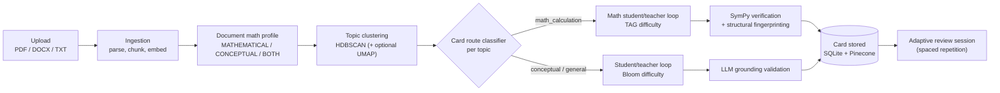

# FlashCards — AI-Powered Study Card Generator

Turn any lecture slide deck, textbook chapter, or notes file (PDF, DOCX, or TXT) into a personalized,
source-grounded flashcard deck. The system reads what you upload, figures out whether the material is
mathematical or conceptual (or both), and drives an AI student/teacher loop to generate questions and
answers - checking math problems deterministically with a computer algebra system instead of just
trusting the model.


## Table of Contents

- [Demo](#demo)
- [Features](#features)
- [Architecture](#architecture)
- [Key Code References](#key-code-references)
- [Tech Stack](#tech-stack)
- [Installation](#installation)
- [Usage](#usage)
- [Project Structure](#project-structure)
- [API Reference](#api-reference)
- [Known Limitations / Roadmap](#known-limitations--roadmap)
- [Contributors](#contributors)
- [License](#license)

## Demo

https://github.com/user-attachments/assets/702ee5d7-03bf-47cb-bef4-01105853d2c9

## Features

- **Document ingestion** for PDF, DOCX, and TXT with automatic chunking and embedding.
- **Document-level math classification** (`MATHEMATICAL` / `CONCEPTUAL` / `BOTH`) that decides whether a
  document is even eligible for math-calculation cards before any topic-level routing happens.
- **Topic clustering** over the embedded chunks (HDBSCAN, with optional UMAP dimensionality reduction for
  large corpora) to organize source material into coherent study topics.
- **Per-topic card routing** into a math-calculation path or a general/conceptual path, using formula
  detection, calculation-verb heuristics, and semantic similarity to worked-example exemplars.
- **LangGraph student/teacher agent loop** for card generation: a _student_ model proposes a question at a
  target difficulty, a _teacher_ model answers it grounded only in retrieved source excerpts, with
  automatic retry/strengthen/restart cycles when generation or grounding fails.
- **Deterministic math verification with SymPy** - worked answers are checked by computer algebra, not
  just judged by an LLM, including multi-step "compound" problems where every step and the final answer
  must be independently solvable and CAS-consistent. Generated math questions also carry a structural
  fingerprint (problem archetype + concepts + operation family) so the dedup gate can reject "same
  template, different numbers" repeats, not just literal duplicates.
- **Two difficulty frameworks**: Bloom's taxonomy for conceptual/general cards, and a TAG
  (conceptual-depth) framework for math cards that scales difficulty by required concepts, steps, and
  method selection - never by making the numbers bigger.
- **Grounding validation** - every non-math answer is scored by an LLM fact-checker against its cited
  source spans before a card is accepted.
- **Adaptive spaced-repetition review sessions** with per-topic proficiency tracking, automatic difficulty
  adjustment, and ease/interval scheduling driven by four review ratings (`i_knew_it`, `almost_knew`,
  `learned_now`, `dont_understand`).
- **Source-grounded citations** - every card links back to the exact document page/span it came from, with
  in-app PDF/TXT preview and highlighted proof text.
- **Guided onboarding tour** for first-time users, plus a self-hosted (no external JWT library) auth
  system with rate-limited login/register.

## Architecture



Uploads are processed by a background job worker (an embedded thread today, designed to run as a
standalone process later) so the API can return immediately while the pipeline runs. The
`generate_single_card` LangGraph graph is the single source of truth for card generation: it owns question
generation, uniqueness checking, answer generation, grounding/math validation, and retry/restart logic as
one explicit state machine (see [`graph.py`](backend/app/services/generation/graph.py)).

## Key Code References

Direct links to the algorithms and logic that do the actual work, not just the files they live in.
All links point at `main`, the repo's default branch.

### AI orchestration & generation

**LangGraph card-generation state machine**
[`graph.py#L1230-L1319`](https://github.com/lioka0099/FlashCardsProject/blob/main/backend/app/services/generation/graph.py#L1230-L1319)
Wires every generation step - route → generate question → embed → check uniqueness → generate answer →
validate → verify math → store - into an explicit `StateGraph` with conditional edges for retry,
strengthen, full-restart, and math-specific fallback. Centralizing the retry/backoff policy as one graph
object (instead of ad hoc retry loops scattered across callers) is what lets math and conceptual cards
share almost the entire pipeline while diverging only at a handful of routed nodes.

**Uniqueness / dedup gate**
[`graph.py#L526-L624`](https://github.com/lioka0099/FlashCardsProject/blob/main/backend/app/services/generation/graph.py#L526-L624)
Rejects a newly generated question if it's too semantically similar (Pinecone cosine search) to any
question already asked in the exam, or - for math - if it shares the same structural fingerprint as a
prior problem even when the numbers/wording differ. The code deliberately hard-fails if
`VECTOR_BACKEND` isn't `pinecone` rather than silently degrading to an unchecked local index, since this
gate is the only thing standing between a study session and repeated questions.

### Deterministic math verification

**Compound (multi-step) math verification**
[`verification.py#L368-L450`](https://github.com/lioka0099/FlashCardsProject/blob/main/backend/app/services/math/verification.py#L368-L450)
For a multi-step problem, runs every machine-checkable step through the SymPy solver-of-record and
confirms the model's declared final answer is CAS-equivalent to the canonical result of the step marked
`is_final`. This is what lets difficulty scale through _chained_ concepts (see the TAG framework below)
without losing deterministic correctness - a multi-step answer is only as trustworthy as its weakest
unverified step, so every step must resolve, not just the last one.

**Math verification dispatcher**
[`verification.py#L453-L507`](https://github.com/lioka0099/FlashCardsProject/blob/main/backend/app/services/math/verification.py#L453-L507)
Routes a single worked answer to the correct SymPy checker (arithmetic, equation/system solving,
derivative/integral, matrix operations, limits, summations) based on a `verification_target.kind` tag
attached at question-generation time. A flat dispatch table instead of one generic "is this right" check
is what makes math grading both deterministic and extensible - a new problem type is one new
`_verify_*` function plus one dispatch line, not a prompt rewrite.

**Structural fingerprinting for math diversity**
[`compound_spec.py#L160-L172`](https://github.com/lioka0099/FlashCardsProject/blob/main/backend/app/services/math/compound_spec.py#L160-L172)
Builds a signature of `archetype + concepts_used + step-kinds` for a generated math problem so two
problems can be flagged as "the same type" even when their surface numbers and wording differ. This is
the extra signal the uniqueness gate checks alongside embedding similarity - plain text/embedding
similarity alone lets "change one number" variants slip through as if they were new questions.

### Classification & routing

**Card route classifier (math vs. conceptual)**
[`card_routing.py#L194-L311`](https://github.com/lioka0099/FlashCardsProject/blob/main/backend/app/services/generation/card_routing.py#L194-L311)
Decides, per topic, whether to generate a calculation-based math card or a conceptual/general card -
combining formula/keyword heuristics, semantic similarity to worked-example exemplars, the document-level
math profile, and the topic's previously cached routing decision. This single branch point determines
which entire generation path (TAG-scaled, SymPy-verified math vs. Bloom-scaled grounded QA) a topic goes
down, so a wrong call either starves a math topic of calculation cards or forces an ungroundable
"calculation" onto conceptual material.

**Document-level math classification**
[`document_math_profile.py#L86-L104`](https://github.com/lioka0099/FlashCardsProject/blob/main/backend/app/services/corpus/document_math_profile.py#L86-L104)
Classifies an entire uploaded document as `MATHEMATICAL`, `CONCEPTUAL`, or `BOTH` before any topic-level
routing happens, via an LLM call with a keyword/formula heuristic fallback if that call fails. This
upstream gate exists because per-topic routing alone over-fires on documents that merely contain numbers
or statistics; a document classified `non_math` here disables the math-calculation route for every topic
inside it, regardless of local signals.

**TAG difficulty framework (conceptual depth, not bigger numbers)**
[`difficulty_frameworks.py#L92-L152`](https://github.com/lioka0099/FlashCardsProject/blob/main/backend/app/services/generation/difficulty_frameworks.py#L92-L152)
Defines four math difficulty levels as required concept count, step count, and whether method
selection/modeling is needed - explicitly not as larger numbers or more digits. This bakes a specific
pedagogical design decision (scale difficulty through conceptual depth, per the Task Analysis Guide model)
directly into the data the prompts are built from, so every math question at a given level carries the
same depth contract instead of that rule living only in a prompt string that could drift.

### Data, scheduling & clustering

**Adaptive topic clustering (HDBSCAN → UMAP → fallback chain)**
[`topics.py#L421-L544`](https://github.com/lioka0099/FlashCardsProject/blob/main/backend/app/services/corpus/topics.py#L421-L544)
Clusters chunk embeddings into topics with HDBSCAN by default (optionally reducing dimensionality with
UMAP above a chunk-count threshold), falling back to agglomerative single-link clustering and finally
k-means if HDBSCAN returns a degenerate result (all noise, or too few clusters). The fallback chain exists
because density-based clustering can legitimately fail on small or unevenly distributed chunk sets, and an
upload pipeline can't afford to hard-fail topic extraction just because one algorithm didn't converge
cleanly on a particular document.

**Spaced-repetition scheduling reducer**
[`card_scheduling_state.py#L72-L144`](https://github.com/lioka0099/FlashCardsProject/blob/main/backend/app/services/review/card_scheduling_state.py#L72-L144)
Pure function mapping a review rating (`i_knew_it` / `almost_knew` / `learned_now` / `dont_understand`)
plus the card's current scheduling state to its next interval, ease factor, and due date - an SM-2-style
algorithm with four outcome buckets instead of the usual "again/hard/good/easy" scale. Being a stateless
`(rating, current_state) -> next_state` reducer with no database access inside it is what makes the
scheduling policy unit-testable in isolation, and mirrors the reducer pattern used for topic proficiency
elsewhere in the codebase.

## Tech Stack

| Layer               | Technology                                                                     |
| ------------------- | ------------------------------------------------------------------------------ |
| Frontend            | Next.js 16 (React 19, TypeScript), Tailwind CSS 4                              |
| Backend / API       | FastAPI, Uvicorn                                                               |
| AI orchestration    | LangGraph (student/teacher agent graph), OpenAI (chat + embeddings)            |
| Math verification   | SymPy (deterministic CAS checking + structural fingerprinting)                 |
| Relational database | SQLite via SQLAlchemy                                                          |
| Vector store        | Pinecone (chunk + question indexes); local NumPy index as an internal fallback |
| Topic clustering    | HDBSCAN, optional UMAP                                                         |
| Testing             | Pytest (backend), Vitest + Testing Library (frontend)                          |

## Installation

### Prerequisites

- Python 3.12+
- Node.js 20+
- An [OpenAI API key](https://platform.openai.com/) (chat completions + embeddings)
- A [Pinecone](https://www.pinecone.io/) account with two indexes (dimension `3072`, cosine metric) - one
  for document chunks, one for generated questions

### Backend

```bash
cd backend
python -m venv .venv
.venv\Scripts\activate      # Windows
# source .venv/bin/activate  # macOS/Linux
pip install -r requirements.txt
```

Create `backend/.env` with the variables below (no `.env.example` ships in the repo yet - this table is
the source of truth):

| Variable                   |    Required    | Default                                       | Description                                                   |
| -------------------------- | :------------: | --------------------------------------------- | ------------------------------------------------------------- |
| `OPENAI_API_KEY`           |      Yes       | —                                             | Chat completions + embeddings                                 |
| `PINECONE_API_KEY`         |      Yes       | —                                             | Vector store auth                                             |
| `PINECONE_INDEX_CHUNKS`    |      Yes       | —                                             | Pinecone index name for document chunk vectors                |
| `PINECONE_INDEX_QUESTIONS` |      Yes       | —                                             | Pinecone index name for question-dedup vectors                |
| `VECTOR_BACKEND`           |       No       | `pinecone`                                    | Card generation's uniqueness gate requires `pinecone`         |
| `EMBED_MODEL`              |       No       | `text-embedding-3-large`                      | OpenAI embedding model                                        |
| `CHAT_MODEL`               |       No       | `gpt-4o`                                      | Model used by the student/teacher agents                      |
| `CHAT_MODEL_FAST`          |       No       | `gpt-4o-mini`                                 | Cheaper model used for classification/routing calls           |
| `DATABASE_URL`             |       No       | `sqlite:///./store/meta.sqlite`               | Any SQLAlchemy URL; `postgres://` is normalized automatically |
| `JWT_SECRET`               | Yes if not dev | dev-only insecure default                     | Required whenever `ENVIRONMENT` isn't `development`           |
| `ENVIRONMENT`              |       No       | `development`                                 | Gates the `JWT_SECRET` requirement above                      |
| `CORS_ALLOW_ORIGINS`       |       No       | `http://localhost:3000,http://127.0.0.1:3000` | Comma-separated allowed origins                               |
| `UPLOAD_DIR`               |       No       | `uploads`                                     | Where uploaded source files are stored                        |
| `VECTOR_STORE_PATH`        |       No       | `./store`                                     | Local SQLite/vector-index directory                           |
| `SQL_ECHO`                 |       No       | `false`                                       | Log every SQL statement (debugging)                           |

### Frontend

```bash
cd frontend
npm install
```

Optionally create `frontend/.env.local`:

| Variable                   | Default                 | Description                                |
| -------------------------- | ----------------------- | ------------------------------------------ |
| `NEXT_PUBLIC_API_BASE_URL` | `http://127.0.0.1:8000` | Base URL the frontend calls the backend on |

## Usage

Run backend and frontend in two terminals:

```bash
# Terminal 1 — backend (from backend/)
uvicorn app.api.endpoints:app --reload --port 8000
```

```bash
# Terminal 2 — frontend (from frontend/)
npm run dev
```

Then open `http://localhost:3000`, register an account, and upload a document from the dashboard. The
pipeline classifies and ingests it, builds topics, generates a diagnostic set of starter cards, and drops
you into a study session once it's ready.

## Project Structure

```
FlashCardsProject/
├── backend/
│   ├── app/
│   │   ├── api/            # FastAPI app, routes, auth, request/response schemas
│   │   ├── data/            # SQLAlchemy models/engine, vector store, Pinecone client
│   │   ├── services/
│   │   │   ├── corpus/      # ingestion, retrieval, topic clustering, document math profiling
│   │   │   ├── generation/  # LangGraph card-generation graph, routing, difficulty frameworks
│   │   │   ├── math/        # SymPy verification, problem specs, math student/teacher models
│   │   │   ├── learner/     # general student/teacher models, per-topic student memory
│   │   │   ├── diagnostic/  # exam bootstrap lifecycle (upload → ready-to-study)
│   │   │   ├── review/      # spaced-repetition scheduling and proficiency tracking
│   │   │   └── session/     # next-card planning and prefetch generation
│   │   └── utils/           # chunking, document loaders (pdf/docx/txt)
│   ├── main.py               # CLI entrypoint (--ingest, --demo, --api_smoke, ...)
│   └── tests/                 # pytest suite
├── frontend/
│   └── src/
│       ├── app/              # Next.js App Router pages (home, exams, login, settings, profile)
│       ├── components/       # exam study/creation UI, onboarding tour, layout
│       └── lib/               # API client, auth/session helpers
└── docs/                       # test plans and design notes
```

## API Reference

All endpoints except `/auth/register` and `/auth/login` require `Authorization: Bearer <token>`.

| Method | Path                                       | Description                                           |
| ------ | ------------------------------------------ | ----------------------------------------------------- |
| POST   | `/auth/register`                           | Create an account, returns a bearer token             |
| POST   | `/auth/login`                              | Authenticate, returns a bearer token                  |
| GET    | `/auth/me`                                 | Current user profile                                  |
| PATCH  | `/auth/me`                                 | Update profile (name/email)                           |
| POST   | `/auth/me/onboarded`                       | Mark the onboarding tour as completed                 |
| POST   | `/auth/change-password`                    | Change password                                       |
| POST   | `/exams/from-upload`                       | Upload documents and start async exam bootstrap       |
| GET    | `/exams`                                   | List the current user's exams                         |
| GET    | `/exams/{exam_id}`                         | Get exam details/state                                |
| GET    | `/exams/{exam_id}/topics`                  | List topics discovered for an exam                    |
| GET    | `/exams/{exam_id}/cards`                   | List generated cards for an exam                      |
| GET    | `/exams/{exam_id}/session/next-card`       | Get the next card for a study session                 |
| GET    | `/exams/{exam_id}/session/previous-card`   | Get the previously served card                        |
| POST   | `/exams/{exam_id}/session/event`           | Log a session telemetry event                         |
| POST   | `/exams/{exam_id}/cards/{card_id}/review`  | Submit a review rating for a card (spaced repetition) |
| GET    | `/exams/{exam_id}/cards/presented-history` | List cards already shown in this exam                 |
| GET    | `/exams/{exam_id}/progress`                | Per-topic proficiency and overall progress            |
| GET    | `/documents/{doc_id}/source`               | Stream the original source file for citation preview  |

> `POST /exams/{exam_id}/topics/{topic_id}/cards/generate` also exists but is intentionally not called by
> the frontend (enforced by [`assertEndpointAllowed`](frontend/src/lib/api/endpoints.ts)) - all card
> generation goes through the session planner instead.

## Known Limitations / Roadmap

- Card generation's uniqueness/dedup gate hard-requires `VECTOR_BACKEND=pinecone`; the local NumPy index
  is an internal fallback for retrieval, not a full Pinecone replacement.
- SQLite was a deliberate choice for this single-instance, portfolio-scale deployment; `DATABASE_URL`
  already supports Postgres if the project ever needs multiple backend instances.
- Deterministic verification covers common arithmetic, equation/system-solving, derivative/integral,
  matrix, limit, and summation problem types — anything outside that set is marked `unsupported` rather
  than silently approved.
- No CI pipeline is configured yet; tests are run locally (`pytest`, `vitest`).
- No hosted/public deployment link yet — update this section once the app is live.

## Contributors

- [Almog Hevroni](https://github.com/almog-hevroni)
- [lioka0099](https://github.com/lioka0099)

## License

MIT — see [LICENSE](LICENSE).
